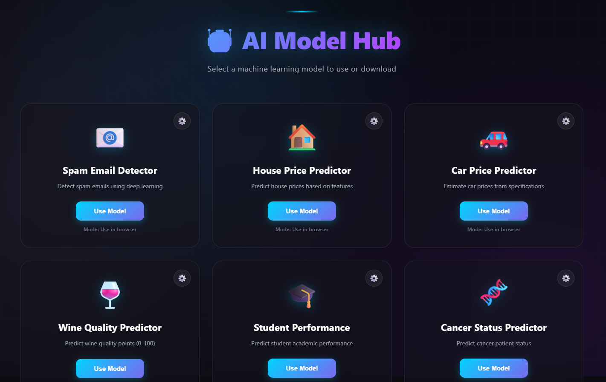
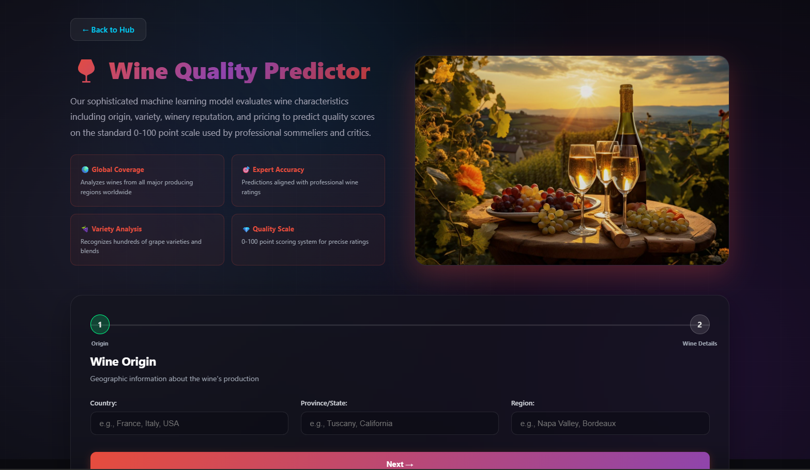
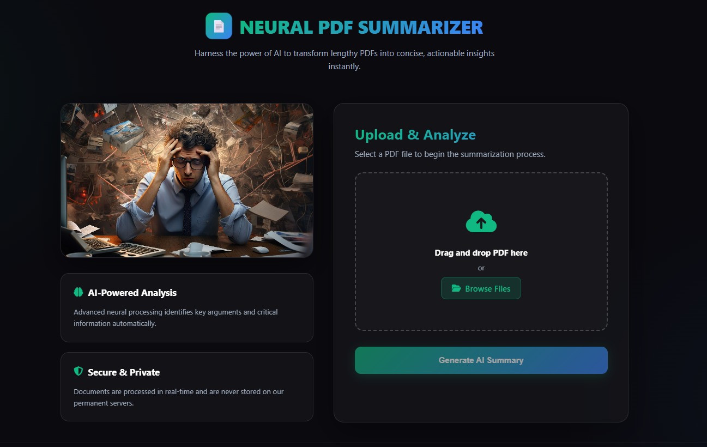

# 🤖 AI Model Hub

<div align="center">


### *Your Gateway to Machine Learning Excellence*

**A comprehensive full-stack web application featuring multiple AI/ML models for predictions, classifications, and intelligent analysis.**

[](https://choosealicense.com/licenses/mit/)
[](https://www.python.org/)
[](https://flask.palletsprojects.com/)
[](https://www.tensorflow.org/)

[Features](#-features) • [Models](#-available-models) • [Installation](#-installation) • [Usage](#-usage) • [Tech Stack](#-tech-stack) • [Contact](#-contact)

</div>

---

## 📸 Preview

<div align="center">

### Main Dashboard


### Model Interfaces
<p float="left">
  
  
</p>

</div>

---

## ✨ Features

<table>
<tr>
<td width="50%">

### 🎯 Core Capabilities
- **Multi-Model Support** - Access 7+ trained AI models
- **Real-time Predictions** - Instant results through web interface
- **Model Downloads** - Export trained models for local use
- **User-Friendly UI** - Intuitive forms for data input
- **Responsive Design** - Works seamlessly across devices

</td>
<td width="50%">

### 🔬 Model Types
- **Traditional ML** - RandomForest, XGBoost
- **Deep Learning** - TensorFlow Neural Networks
- **NLP Models** - Transformer-based text analysis
- **Regression & Classification** - Diverse prediction tasks
- **Pre-trained APIs** - State-of-the-art summarization

</td>
</tr>
</table>

---

## 🧠 Available Models

| Model | Type | Task | Technology | Status |
|-------|------|------|------------|--------|
| 🩺 **Cancer Prediction** | Classification | Medical diagnosis prediction | RandomForest / XGBoost | ✅ Active |
| 🚗 **Car Price Prediction** | Regression | Vehicle valuation | RandomForest / XGBoost | ✅ Active |
| 🏠 **House Price Prediction** | Regression | Real estate valuation | RandomForest / XGBoost | ✅ Active |
| 🎓 **Student Performance** | Classification/Regression | Academic outcome prediction | RandomForest / XGBoost | ✅ Active |
| 🍷 **Wine Quality Assessment** | Classification | Wine quality grading | RandomForest / XGBoost | ✅ Active |
| 📧 **Email Classification** | NLP Classification | Spam/category detection | TensorFlow Transformers | ✅ Active |
| 📄 **PDF Summarization** | NLP Summarization | Document summarization | BART (facebook/bart-large-cnn) | ✅ Active |

---

## 🚀 Installation

### Prerequisites
- Python 3.9.13
- pip package manager
- Virtual environment (recommended)

### Step-by-Step Setup

1️⃣ **Clone the Repository**
```bash
git clone https://github.com/yourusername/ai-model-hub.git
cd ai-model-hub
```

2️⃣ **Create Virtual Environment**
```bash
python -m venv venv
```

3️⃣ **Activate Virtual Environment**
```bash
# Windows
venv\Scripts\activate

# macOS/Linux
source venv/bin/activate
```

4️⃣ **Install Dependencies**
```bash
pip install -r requirements.txt
```

> ⚠️ **Important:** Strictly follow the dependency versions specified in `requirements.txt` to ensure compatibility.

5️⃣ **Run the Application**
```bash
python app.py
```

6️⃣ **Access the Application**
```
Open your browser and navigate to: http://localhost:5000 <=== in here, actually, any available port that your local has.
```

---

## 📦 Dependencies

```txt
Python==3.9.13
Flask==3.1.2
tensorflow==2.10.1
scikit-learn==1.6.1
pandas==2.3.3
numpy==1.26.4
matplotlib==3.9.4
seaborn==0.13.2
h5py==3.14.0
joblib==1.5.3
transformers==latest
```

> 💡 **Note:** These exact versions are required for optimal performance and compatibility.

---

## 💻 Tech Stack

<div align="center">

### Frontend


### Backend


### Machine Learning & AI


### Visualization


</div>

---

## 🎯 Usage

### For End Users

1. **Navigate to Homepage** - Browse available models
2. **Select a Model** - Click on your desired prediction model
3. **Input Data** - Fill in the required form fields
   - Numerical inputs for regression models
   - Text inputs for NLP models
   - File uploads for PDF summarization
4. **Get Predictions** - Receive instant AI-powered results

---

## 🏗️ Architecture

```
AI_Model_Hub/
├── app.py                 # Flask application with route handlers
├── templates/             # HTML templates
│   ├── index.html        # Main landing page
│   ├── cancer.html       # Cancer prediction interface
│   ├── car.html          # Car price prediction
│   ├── house.html        # House price prediction
│   ├── student.html      # Student performance
│   ├── wine.html         # Wine quality assessment
│   ├── email.html        # Email classification
│   └── upload_pdf.html   # PDF summarization
├── static/
│   └── images/           # UI screenshots
├── deeplearning_models/  # Trained model files (.pkl, .h5)
├── supervised_models/    # Trained model files (.joblib)
├── requirements.txt      # Python dependencies
└── README.md             # Project documentation
```

---

## 📝 License

This project is licensed under the **MIT License** - see the [LICENSE](LICENSE) file for details.

```
MIT License

Copyright (c) 2024 Thonedra

Permission is hereby granted, free of charge, to any person obtaining a copy
of this software and associated documentation files...
```

---

## 👨‍💻 Author

<div align="center">

### **Thonedra**

[](mailto:thonedra.dev@gmail.com)
[](tel:0182128530)

*Passionate about AI/ML and building intelligent systems*

</div>

---

## ⭐ Show Your Support

If this project helped you, please consider giving it a ⭐️!

---

## 📊 Project Statistics

<div align="center">


</div>

---

## 🔮 Future Enhancements

- [ ] Add model performance metrics dashboard
- [ ] Implement user authentication
- [ ] Deploy to cloud platform (AWS/Azure/GCP)
- [ ] Add API documentation (Swagger/OpenAPI)
- [ ] Implement model versioning
- [ ] Add batch prediction capabilities
- [ ] Create mobile-responsive UI improvements
- [ ] Add more pre-trained models

---

<div align="center">

### 🌟 Built with passion for AI/ML excellence 🌟

**Made with ❤️ by Thonedra**

---

*Last Updated: 2024*

</div>